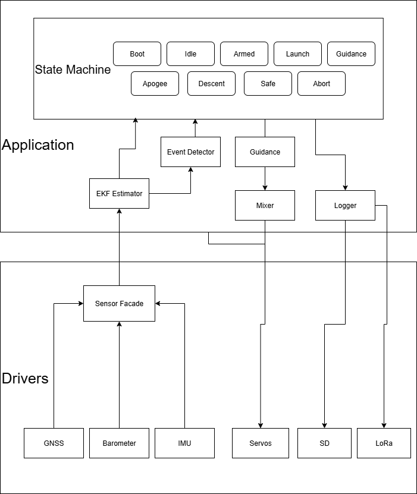

# Finware
Firmware for active control rocket.

Breakout Components:
1. AdaFruit Feather STM32F405 Express
2. AdaFruit BNO085 IMU
3. SparkFun NEO-M9N GNSS
4. AdaFruit LPS22 Barometer
5. AdaFruit RFM95W LoRa
6. AdaFruit PowerBoost 5V Buck Converter
7. Ublox ANN-MB-00 GNSS Antenna

## Repository Structure
- `firmware/` – All code for flight computer firmware.
- `hardware/` – Schematics, PCB layouts, fab notes.
- `docs/` – Reference docs, test plans, logs, design notes.
- `model/` - Simulink model and related matlab functions.

## Requirements
- [VS Code](https://code.visualstudio.com/) + [PlatformIO IDE extension](https://platformio.org/install/ide?install=vscode)  
- Board: **Adafruit Feather STM32F405 Express** (`adafruit_feather_f405`)  
- USB DFU drivers:  
  - Windows: [STM32CubeProgrammer](https://www.st.com/en/development-tools/stm32cubeprog.html)  
  - Linux/macOS: install `dfu-util`

## How to Build & Upload
1. Navigate to the firmware/src folder:
   ```bash
   cd Finware/firmware/src
2. Build
   ```bash
   pio run
3. Put the board in DFU mode (BOOT0 -> 3.3V, press RESET).
4. Upload
   ```bash
   pio run -t upload
5. Open serial monitor
  ```bash
  pio device monitor
  ```
Serial runs at 115200 on COM5. Steps 1-5 may also be done through VS Code and Platformio GUI.
   

## Software Architecture



